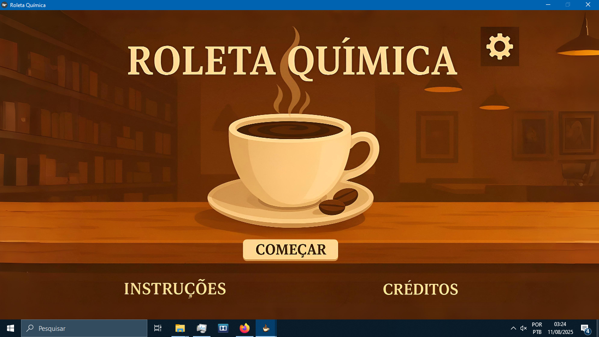
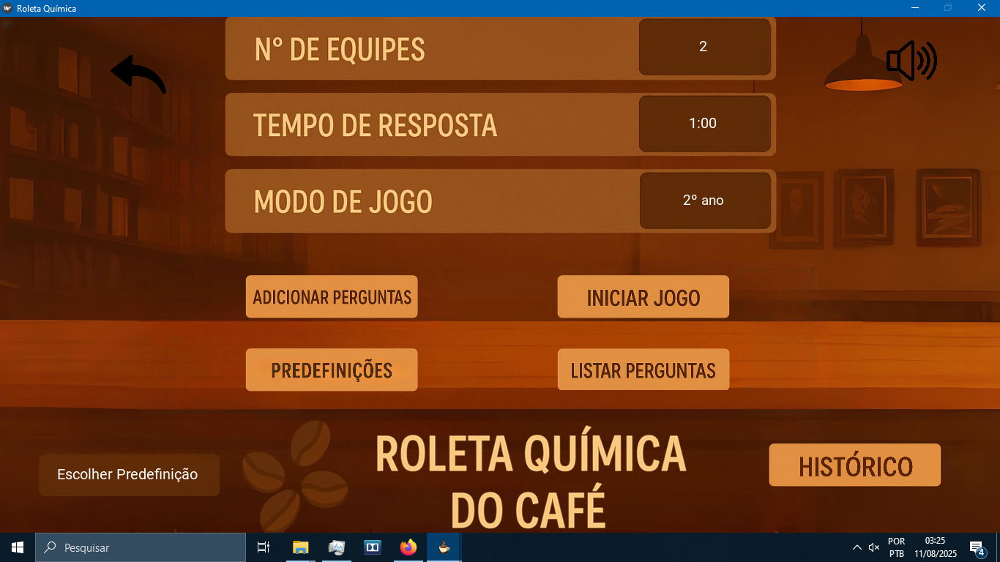
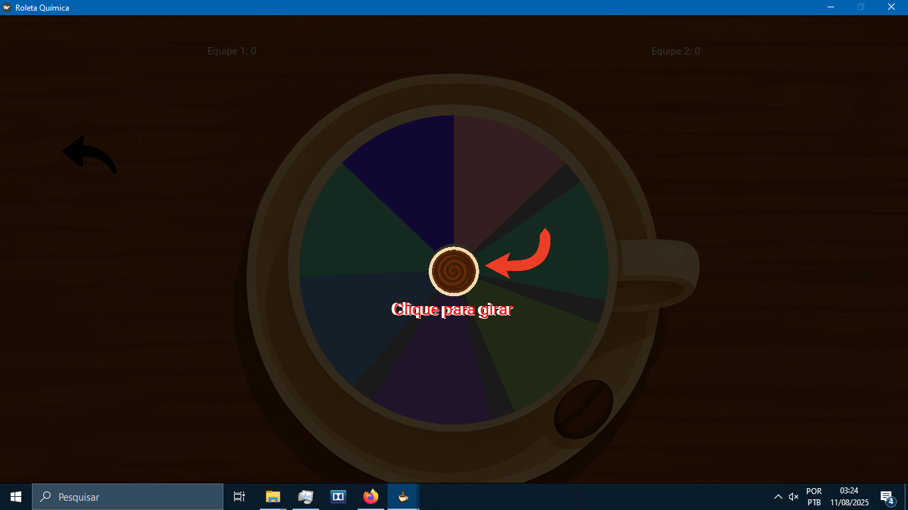
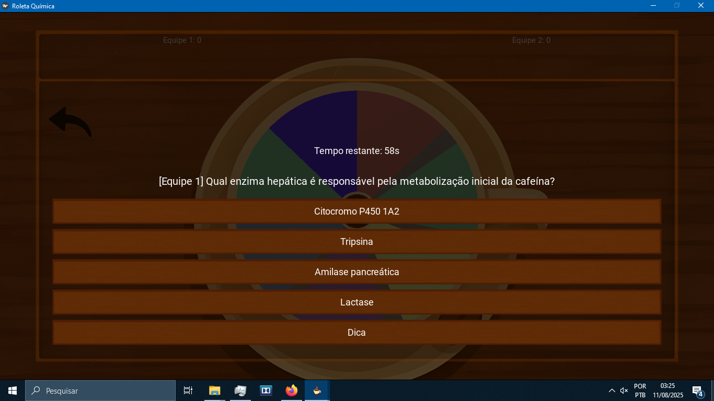

[README.md](https://github.com/user-attachments/files/21710199/README.md)

# Roleta Química

[](https://www.python.org/)
[](https://kivy.org/)
[](#licença)

Jogo de perguntas e respostas com **roda da sorte** para tornar aulas e revisões mais engajantes. Defina tempo por questão, equipes, gire a roda e responda. O placar é atualizado em tempo real e cada sessão fica registrada no **Histórico**, com **exportação TXT/CSV**.

<div align="center">
  
</div>

---

# Sumário
- [Como jogar](#como-jogar)
- [Recursos](#recursos)
- [Instalação](#instalação)
- [Executar](#executar)
- [Estrutura do projeto](#estrutura-do-projeto)
- [Bibliotecas e stack](#bibliotecas-e-stack)
- [Empacotar (EXE)](#empacotar-exe)
- [Adicionar/editar perguntas](#adicionareditar-perguntas)
- [Problemas comuns](#problemas-comuns)
- [Licença](#licença)

---

# Como jogar

## 1) Introdução
Abra o app e clique em **Começar** para ir à tela inicial.

## 2) Tela inicial
Defina rapidamente as regras da sessão:
- **Nº de equipes**
- **Tempo de resposta:** 1:00 a 5:00 (passos de 30 s)
- **Modo de jogo** (ex.: 1º, 2º, 3º ano ou Coffee Lovers)
- **Predefinições** (opcional): carregam filtros prontos
- Acesse **Histórico**, **Adicionar Perguntas** ou **Listar Perguntas** conforme a necessidade

<div align="center">
  
</div>

Clique em **Iniciar Jogo**.

## 3) Filtros iniciais
Sem predefinição, um popup pedirá **Áreas** e **Dificuldades** (selecione pelo menos 1 de cada). Com predefinição, os filtros são carregados automaticamente.

## 4) Tela de jogo – girar a roda
- Clique na roda para **girar** (animação com aceleração/desaceleração).
- Ao parar, a área sorteada é destacada e a pergunta correspondente é aberta.
- **Casas especiais** **+5**/**–5** aplicam bônus/penalidade imediata e pulam a vez.

<div align="center">
  
</div>

## 5) Respondendo à pergunta
- Um popup exibe **cronômetro**, enunciado e **4 alternativas**. O botão **Dica** pode estar disponível.
- **Acerto:** toca som e soma pontos conforme a dificuldade *(ex.: Fácil 15, Médio 20, Difícil 30)*.
- **Erro/Tempo zerado:** toca som de erro e passa a vez.
- O **placar** é atualizado; a **equipe da vez** alterna automaticamente.

<div align="center">
  
</div>

## 6) Encerrar e salvar
Use **Encerrar Jogo** para finalizar. O app calcula a(s) equipe(s) vencedora(s), registra a sessão e volta para a introdução.

## 7) Histórico e exportação
Acesse **Histórico** na tela inicial para rever as sessões. Clique em **Exportar** para gerar **TXT** e **CSV** contendo filtros, perguntas/respostas, tempo de início/fim e placar final.

---

# Recursos
- **Roda animada** com aceleração/frenagem e realce do setor sorteado
- **Placar por equipes** com atualização automática
- **Cronômetro** por pergunta e **efeitos sonoros** (acerto/erro/tempo)
- **Casas especiais** (+5/–5)
- **Histórico completo** por sessão com **exportação TXT/CSV**
- **Pré-carregamento (loading)** de imagens/áudio/vídeo e bancos JSON
- **Múltiplas telas**: introdução, inicial, jogo, listas/editor, predefinições, histórico

---

# Instalação

> Recomendado: **Python 3.11**

```bash
# 1) (Opcional) Ambiente virtual
python -m venv .venv
# Windows
.venv\Scripts\activate
# macOS/Linux
source .venv/bin/activate

# 2) Dependências
pip install --upgrade pip
pip install kivy ffpyplayer
```

> **Windows:** se áudio/vídeo não tocar, reinstale `ffpyplayer` (`pip install --force-reinstall ffpyplayer`).

---

# Executar

Na raiz do projeto:

```bash
python telas_e_botoes.py
```

O app inicia com **loading**, depois segue para a **introdução**.

---

# Estrutura do projeto

```
/ (raiz)
├─ telas_e_botoes.py        # App principal e roteamento de telas
├─ introducao.py            # Tela/fluxo de introdução
├─ loading_screen.py        # Pré-carregamento de assets e dados
├─ preloader.py             # Utilitários de preload
├─ roda_animada.py          # Lógica/anim. da roda
├─ predefinicoes.py         # CRUD de predefinições (filtros prontos)
├─ historico.py             # Visualização e exportação (TXT/CSV)
├─ assets/                  # Imagens, ícones, fundos
├─ sons/                    # Efeitos sonoros
├─ videos/                  # Vídeos de abertura/transição (opcional)
├─ configs/
│  ├─ historico_log.jsonl   # Log das sessões (gravado automaticamente)
│  └─ exports/              # TXT/CSV exportados pelo usuário
└─ dataperguntas/           # Bancos de perguntas (.json)
```

---

# Bibliotecas e stack
- **Linguagem:** Python
- **UI/Animações:** [Kivy](https://kivy.org)
- **Áudio/Vídeo:** [ffpyplayer](https://github.com/matham/ffpyplayer)
- **Dados/Exportação:** `json`, `csv` (stdlib)
- **Utilitários:** `uuid`, `glob`, `random`, `time`, `datetime` (stdlib)

---

# Empacotar (EXE)

## Opção A — direto pelo PyInstaller
```bash
pyinstaller --noconfirm --windowed --name "Roleta_Quimica" telas_e_botoes.py
```
Depois, copie **assets/**, **sons/**, **videos/**, **configs/** e **dataperguntas/** para a pasta do executável (ou configure `--add-data`).

## Opção B — usando `.spec`
Se já tiver um `.spec` com `datas/binaries` ajustado:
```bash
pyinstaller Roleta_Quimica.spec
```

> Para criar um **instalador** com wizard, use **Inno Setup** e inclua as pastas do jogo na seção `Files`.

---

# Adicionar/editar perguntas
1. Abra **dataperguntas/** e escolha o JSON do modo desejado.
2. Cada item contém: **área**, **dificuldade**, **enunciado**, **alternativas** e **correta**.
3. Salve e reinicie o jogo.

> Sugestão: padronize nomes de **áreas** e **dificuldades** para melhor distribuição na roda.

---

# Problemas comuns
- **Sem som/vídeo:** `pip install --force-reinstall ffpyplayer`
- **Assets não carregam:** confirme pastas **assets/**, **sons/**, **videos/** ao lado do executável (build) ou na raiz (dev)
- **Exportação falhou:** verifique permissões na pasta `configs/exports/`
- **Roda sem áreas:** selecione ao menos 1 **área** e 1 **dificuldade** antes de iniciar

---

# Licença
Distribuído sob a **MIT License**. Veja `LICENSE`.
